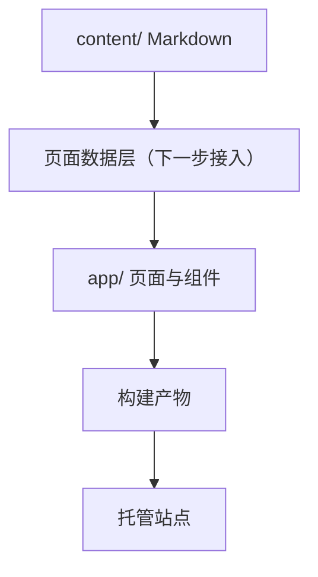

# 项目与内容架构

```mermaid
flowchart TD
  A["content/ Markdown"] --> B["页面数据层（下一步接入）"]
  B --> C["app/ 页面与组件"]
  C --> D["构建产物"]
  D --> E["托管站点"]
```

当前版本已经完成了页面与视觉组件层，并建立了内容目录。Markdown 解析、RSS、搜索、评论和外部同步都应在内容稳定之后按需接入。
