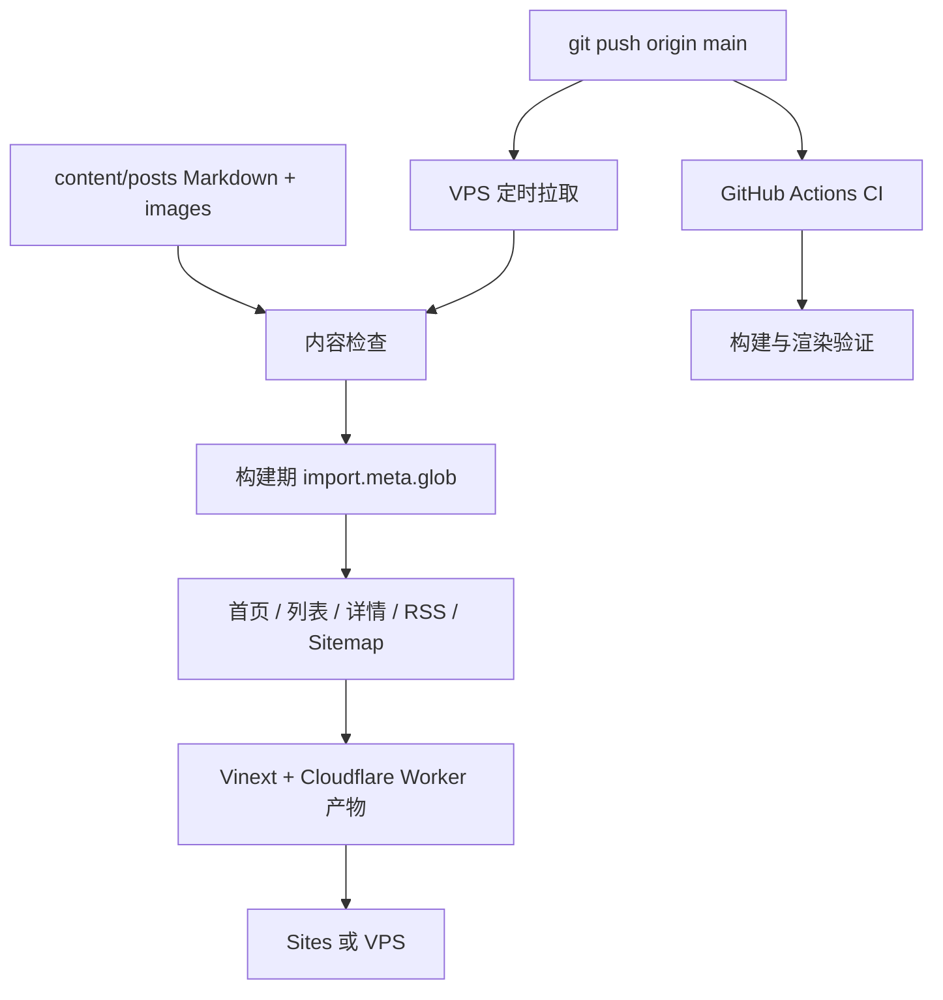

# 项目与发布架构

## 内容层

`app/lib/posts.ts` 在构建期扫描文章和图片。正文只进入服务端组件，首页和列表客户端组件只接收摘要，避免把所有 Markdown 打进浏览器包。支持 PNG、JPG/JPEG、WebP、GIF 和 AVIF；封面使用 `cover.*` 约定。

## 展示层

首页遵循参考站当前的四段结构：个人简介、文章、项目、页脚。`app/site-config.ts` 是个人信息的单一配置入口。文章详情使用同一份文章记录生成可见内容、标题、描述和社交分享元数据。

## 发布层

CI 与 VPS 都运行内容检查和生产构建。VPS 部署脚本只接受 `origin/main` 的 fast-forward 更新；工作区不干净、构建或测试失败时不会重启服务，也不会更新成功标记，因此下一轮会重试。
