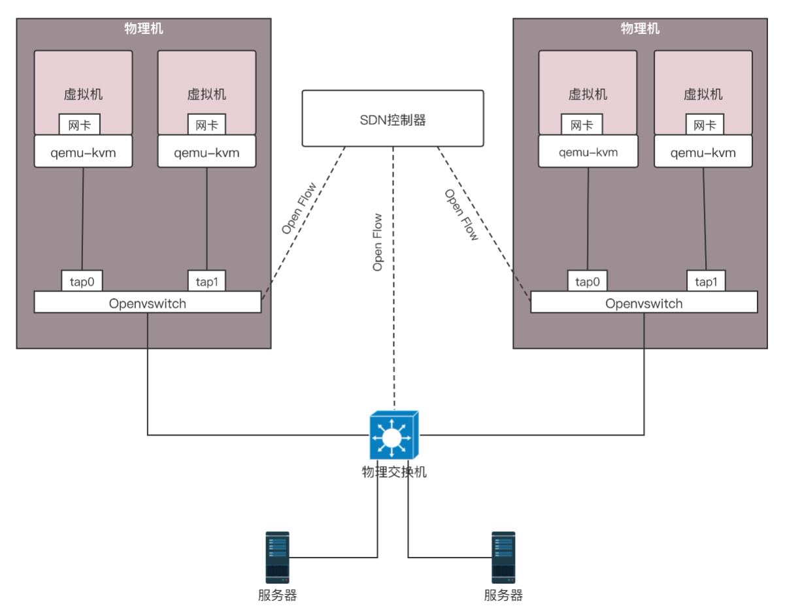
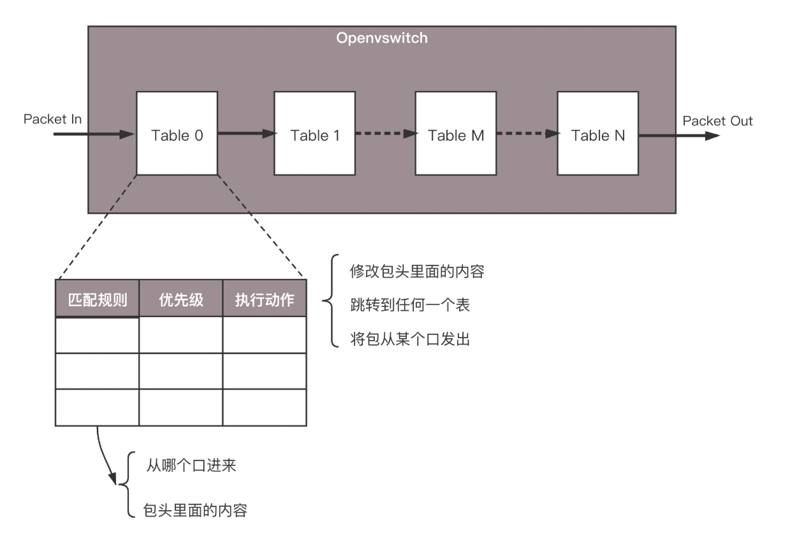
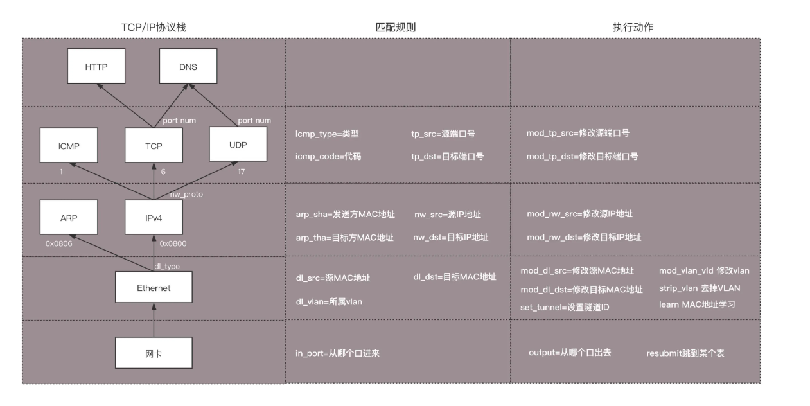
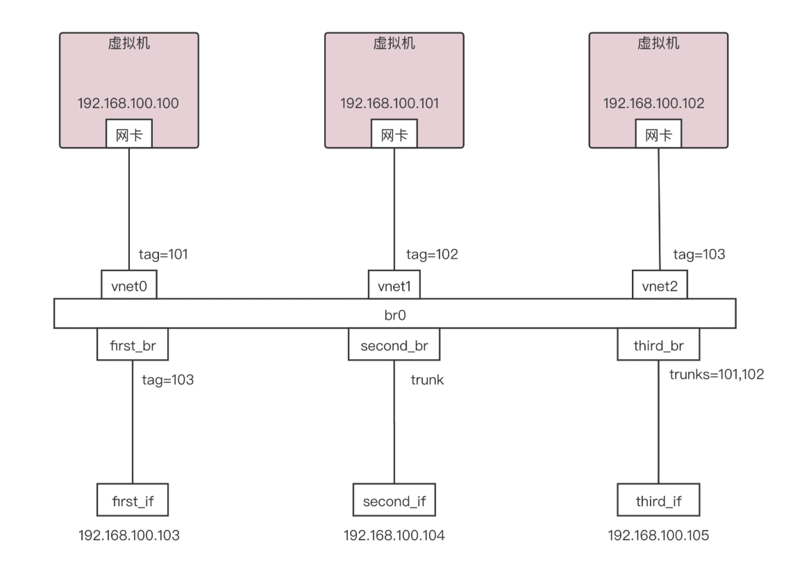
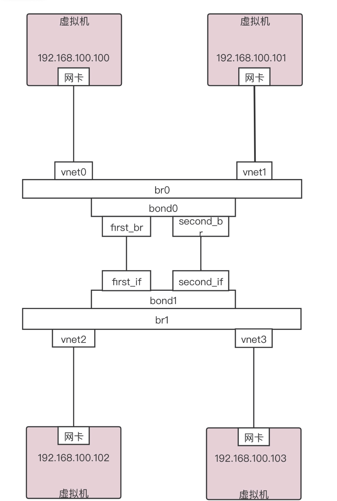

# 第25讲 软件定义网络：共享基础设施的小区物业管理办法

## 一、 从传统网络到软件定义网络 (SDN)

### 为什么要从传统网络到SDN？

传统数据中心在使用原生 VLAN 和普通 Linux 网桥（brctl）管理云平台网络时，存在严重的痛点：

1. **配置极其不灵活**：没有统一的管理入口，配置一条跨机器的网络通路，需要挨个登录到每一台物理机上去修改网络参数。
2. **缺乏全局视图**：网络由一台台孤立的物理交换机和虚拟网桥组成，无法在全局层面统筹整个数据中心的流量。
3. **类比场景**：这就像管理一个大型小区的公共设施（网络就像小区的路、门、电梯）。如果物业没有一个智能中央监控室，每次遇到早高峰想调整电梯速度或者多开几个出口，管理员都得一路小跑去现场一个个拨开关，效率极低且容易出错。

为了解决这些问题，云计算引入了**软件定义网络 (SDN)**。

### SDN 的三大核心特点

1. **控制与转发分离**：转发平面就是具体的虚拟或物理网络设备（相当于小区里的一条条路）；控制平面是统一的控制中心（相当于监控室）。路负责走人，监控室负责发号施令，彻底分离。
2. **开放的标准化接口**：控制器向上层应用提供统一 API（叫作**北向接口**，供上层调用）；向下调用指令控制底层的网络设备（叫作**南向接口**，用于下发规则）。
3. **逻辑上的集中控制**：控制平面可以一览无余地获取全局的网络状态视图，并据此对整个物理网络的流量路由进行实时优化。
- **SDN (Software Defined Network)**：软件定义网络，一种将网络控制面与数据转发面彻底分离的创新网络架构体系。
- **北向接口/南向接口**：SDN控制器架构中的术语。与上方应用系统通信的接口叫北向接口（上北）；与下方网络交换设备通信的接口叫南向接口（下南）。

---

## 二、 OpenFlow 与 OpenvSwitch 原理

SDN 有很多种实现，公有云中最著名的一种开源实现方式就是通过 OpenFlow 协议与 OpenvSwitch 搭配使用。

### 1. 流表 (Flow Table) 万能匹配规则

在 OpenvSwitch 里面，有一个核心概念叫**流表 (Flow Table)**。任何进入这个虚拟交换机的网络包，都必须乖乖地经过这些规则的检验。

流表规则具有优先级，网络包到来时会执行如下流转：

网络包 —> 匹配高优先级规则 —> 若不中则匹配低优先级规则 —> 满足条件 —> 触发动作 (丢弃 / 转发 / 修改包头内容)。

之所以说它极其强大，是因为它可以对网络四层进行“为所欲为”的修改：

- **物理层**：匹配从哪个网口进来；执行从哪个网口出去。
- **MAC层**：匹配源/目标 MAC 地址及 VLAN ID；动作可以修改 MAC、添加或剥离 VLAN。
- **网络层**：匹配源/目标 IP 地址；动作可以直接篡改 IP 地址（实现 NAT）。
- **传输层**：匹配源/目标端口号；动作可以修改端口号。

### 2. OVS 的架构与数据包流转推演

OpenvSwitch 内部被划分为了**用户态**和**内核态**两大部分，以兼顾灵活性和转发性能：

1. **用户态**有两大核心进程：
    - OVSDB 进程：负责持久化保存虚拟交换机、端口等拓扑配置（接收 ovs-vsctl 命令）。
    - vswitchd 进程：负责保存**全量的流表规则**（接收 ovs-ofctl 命令，或者远程 SDN 控制器的指令）。
2. **内核态**有 OpenvSwitch.ko 模块（Datapath）：内部包含一个**小型的快速缓存流表**，用于在网卡驱动层面极速处理数据。

**数据包底层流转全链路**：

网络包到达物理网卡 —> 触发内核 Datapath 函数 —> 提取 L2-L4 层特征 —> 在内核态快速 Flow Table 匹配规则 —> **如果未命中 (Miss)** —> 触发 Netlink 通信发送 **upcall** 给用户态的 vswitchd 进程 —> 在用户态全量流表中找到处理动作 —> 执行修改/转发动作 —> 触发 **reinject** 将数据包注回内核发出去，同时将这条匹配规则缓存到内核态流表中（加速下一次相同请求）。

- **OpenFlow**：SDN 控制器用来远程控制网络设备、下发流表规则的“南向接口”协议标准。
- **OpenvSwitch (OVS)**：一款企业级的高性能开源软件虚拟交换机，原生支持 OpenFlow 协议，是云网络底层基础设施。

---

## 三、 虚拟网卡连接到云中及网络解耦

### 1. 实验一：实现 VLAN 与端口类型

普通网桥靠配置物理隔离，而 OVS 靠**端口属性**玩转 VLAN，主要有两种端口：

1. **access port (接入端口)**：专门给虚拟机网卡准备的。
    - 配置上一个 tag（例如 tag=101）。包从虚拟机**进入**这个端口，会被 OVS 偷偷打上 VLAN 101 的标签。包从这个端口**发向**虚拟机，OVS 会把 VLAN 101 的标签剥离掉，因为虚拟机本身不知道什么是 VLAN。
2. **trunk port (干道端口)**：专门给连接其他交换机准备的。
    - 内部配置 trunks 参数（例如 trunks=101,102）。只要包里带着 101 或 102 的标签，就允许原封不动地通过；其他标签丢弃。

### 2. 实验二：模拟网卡绑定 (Bond) 高可用

数据中心里为了防止网卡或网线坏掉，会把两块网卡绑在一起用。OVS 甚至不用硬件，纯软件就能模拟 Bond：

- **active-backup (主备模式)**：左边的网卡是 active，流量全走左边；左边网卡一挂，右边 backup 瞬间顶上。
- **balance-slb / balance-tcp**：这两条路同时跑数据，按照 MAC、IP、端口等特征进行哈希负载均衡，提升总带宽。

### 3. 解耦：如何在云计算中使用 OpenvSwitch

过去，虚拟机的 VLAN 和物理机机房的物理 VLAN 是强制 1:1 映射的，牵一发而动全身。

引入 OVS 后，实现了解耦：

1. 一台物理机上的上百台虚拟机，全挂载到 br0 网桥上，分配简单的内部 VLAN 标签（1~4096 绝对够用）。
2. 当数据包要离开物理机前往其他机器时，利用 OVS 强大的流表能力拦截该包，匹配其内部 dl_vlan，然后执行 mod_vlan_vid 动作，**将其无缝替换为机房物理网络规划的全局 VLAN ID**。
3. 由此，内部随便怎么配，不影响外部物理网络的拓扑规划。
- **Bonding (网卡绑定)**：把多张物理网卡逻辑上聚合为一张网卡，实现网络流量的负载均衡，并消除单点故障。

---

## 四、 小结

本节课核心脉络梳理：

1. 软件定义网络（SDN）的核心思想是**控制面（统一发令）和数据面（傻瓜执行）分离**，提供了上帝视角的集中管理能力。
2. **OpenvSwitch (OVS)** 作为一个强大的软件交换机，通过匹配**流表 (Flow Table)**，实现了对网络包涵盖二到四层的拦截、修改和转发。
3. OVS 底层采用**内核态快速匹配 + 用户态全量匹配 (upcall/reinject)** 的架构兼顾了速度与灵活性。
4. 借由 OVS 对报文的任意修改能力，云计算平台成功将虚拟网络规划与物理网络规划彻**解耦**。

---

## 五、 思考题深度解析

- **思考题 1：在这一节中，提到了可以通过VIP可以通过流表在不同的机器之间实现负载均衡，你知道怎样才能做到吗？**
    
    **【深度解析】**
    
    这就体现了 OVS 简直是把“网络数据包当面团捏”的恐怖能力。我们完全不需要买昂贵的 F5 硬件负载均衡，也不用装 LVS，只用流表就能做到：
    
    1. 控制中心给一个业务分配一个虚拟 IP（VIP），所有用户都访问这个 VIP。
    2. 控制器在 OVS 里面写一条流表：当收到的包 目的IP == VIP 时，执行动作 mod_nw_dst = 后端某台真实机器的IP（可以配合轮询策略），并 mod_dl_dst = 后端机器MAC。
    3. 当后端机器回包时，流表再匹配这台机器的源 IP，执行动作将其修改回 VIP 响应给用户。
        
        通过这种**底层无感知 IP 替换 (DNAT/SNAT)**，在虚拟交换机这一层就直接完成了负载均衡的功能。
        
- **思考题 2：虽然 OpenvSwitch 可以解耦物理网络和虚拟网络，但是在物理网络里面使用 VLAN，数目还是不够，你知道该怎么办吗？**
    
    **【深度解析】**
    
    这是引出后续云计算核心网络架构的终极一问。传统 VLAN ID 使用 12个 bit 表示，最大值只有 4096。这对于拥有几十万租户的阿里云、腾讯云来说，根本连塞牙缝都不够。
    
    解决办法就是**彻底抛弃二层 VLAN 隔离，走向大二层技术——VXLAN（虚拟可扩展局域网）**。
    
    VXLAN 巧妙地采用了 **MAC-in-UDP** 封装技术：
    
    它在虚拟机原本发出的以太网包外面，再套上一层 VXLAN 头部（带有 24 bit 的 VNI，支持 1600万 个租户隔离），然后再套上物理机的 UDP 和 IP 头部。这样，原本不能跨越路由器的二层数据包，就坐上了三层 UDP 的“顺风车”，在整个数据中心甚至跨地域无缝漂移。
