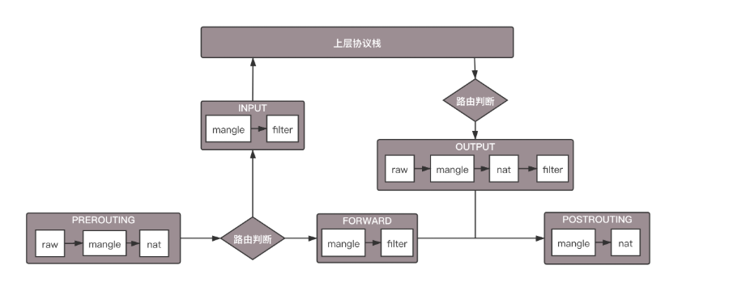
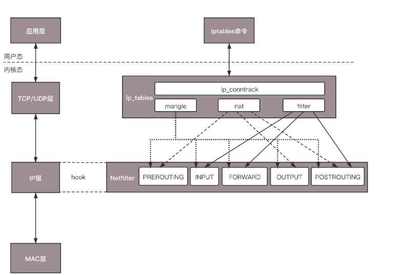
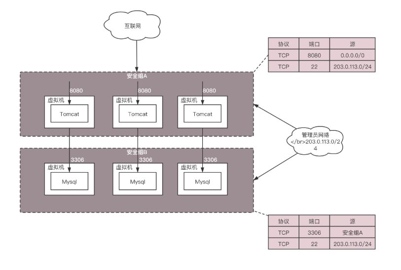
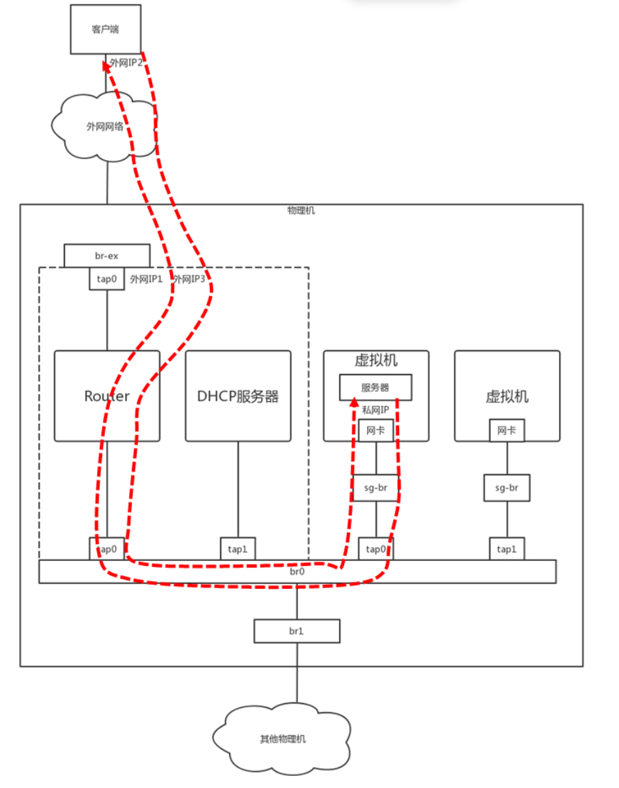

# 第26讲 云中的网络安全：虽然不是土豪，也需要基本安全和保障

## 一、 云中的网络安全痛点与解法

### 为什么公有云环境需要安全加固？

传统物理机房我们有物理防火墙，而在公有云上，如果你直接暴露虚拟机，会面临极其危险的环境：

1. **环境不纯净**：公有云像一个大杂院，黑客会无时无刻不在扫描全网暴露的端口，探测应用的漏洞。
2. **木桶效应（致命短板）**：假设你加固了一套电商核心应用，但操作系统里某个不起眼的后台进程存在漏洞且端口对外开放。黑客就能通过这个“没关严的厕所窗户”潜入，进而拿下了整台机器。

**解法：**

对待公有云虚拟机，最佳实践是：**只开放绝对必需的端口（比如 80 和 443），其余全部封死**。

在云平台上，通过定义 **ACL（访问控制列表）** 的规则集合来实现这种隔离。云服务商将这些规则的集合打包成产品，也就是我们常听到的 **安全组 (Security Group)**。

- **ACL (Access Control List)**：访问控制列表，一种基于 IP 地址、协议和端口号等条件，用来控制网络流量进出的安全规则表。
- **安全组 (Security Group)**：云平台上的虚拟防火墙，本质上是针对一组虚拟机的入站和出站流量下发的 ACL 规则集合。

---

## 二、 底层技术原理拆解：Netfilter 与 iptables

安全组这么强大，底层到底是谁在干活？这就不得不提 Linux 著名的网络大杀器：iptables。

### 1. 数据包流转的五个关键节点

在 Linux 内核中，有一个叫作 **Netfilter** 的框架。它在网络数据包的处理流程中埋下了 5 个 hook（钩子）函数节点，允许系统随时拦截并干预数据包：

1. **PREROUTING**：数据包刚进入机器网卡，还没有进行路由判断之前。
2. **INPUT**：路由判断后，发现数据包的目的 IP 是本机，准备向上层应用转发前。
3. **FORWARD**：路由判断后，发现目的 IP 不是本机，需要从另一个网口转发出去时。
4. **OUTPUT**：本机应用产生数据包，准备向外发送，在路由判断之后。
5. **POSTROUTING**：无论包是从本机出去的还是转发出去的，在最终离开网络接口发送之前。

**底层流转（数据走向）：**

网络包 —> PREROUTING —> 【路由判断】 —> (如果是发给本机) INPUT —> 本机应用处理完毕 —> OUTPUT —> POSTROUTING —> 发出网卡

└—> (如果需跨网转发) FORWARD —> POSTROUTING —> 发出网卡

### 2. iptables 的“四表五链”

iptables 是控制 Netfilter 的命令行工具。它将不同功能的规则分门别类放在了“表 (Table)”中，然后挂载到上面提到的 5 个节点（即“链 Chain”）上。

按照功能可以分为四大类：连接跟踪（conntrack）、数据包过滤（filter）、网络地址转换（nat）、数据包修改（mangle）。其中连接跟踪是基础功能，被其他功能所依赖。其他三个可以实现包的过滤、修改和网络地址转换。

- **四种表（按处理优先级由高到低）**：raw、mangle、nat、filter。主要使用的是后三种：
    - **filter 表**：负责数据包过滤（允许或丢弃）。主要挂载在 INPUT、FORWARD、OUTPUT 链。
    - **nat 表**：负责网络地址转换。主要挂载在 PREROUTING、OUTPUT、POSTROUTING 链。
    - **mangle 表**：负责修改数据包头内容。五个链都有挂载。
- **Netfilter**：Linux 内核中用于网络数据包过滤、操作和地址转换的核心框架。
- **iptables**：运行在用户态的客户端命令行工具，用来向内核态的 Netfilter 框架下发规则指令。

---

## 三、 虚拟网络中的安全与 NAT 实现

### 1. 云平台安全组的批量下发机制

如果在几百台虚拟机里挨个敲 iptables 命令太低效了，云平台的做法是“统一管控”：

1. 多台虚拟机通过 TAP 虚拟网卡连接到一个共同的二层虚拟网桥上。
2. 平台在这层虚拟网桥上统一配置 iptables 规则。
3. 物理机上跑一个 Agent（代理），将用户在网页控制台点击配置的安全组策略，自动翻译成 iptables 命令下发到网桥上。

### 2. 私网与公网的互通：SNAT 与 DNAT

虚拟机的网卡通常配置的是私有 IP（内网 IP），为了让它能上网或者对外提供服务，iptables 的 **nat 表** 功不可没。

- **SNAT (Source NAT, 源地址转换) —— 解决虚拟机访问外网**
    - **场景**：虚拟机主动访问 163 网站。
    - **机制**：在数据包离开外网口（POSTROUTING 链）时，利用 iptables 的 MASQUERADE（地址伪装）动作，将包的源 IP（私网IP）替换为物理机的公网 IP 发出去。多台虚拟机可以共享同一个公网 IP。
    - **返回路径 (核心机制)**：依靠 Netfilter 的 **conntrack（连接跟踪）** 表。内核记录了“是谁发起了这个连接”。当 163 网站的数据包返回时，系统会查阅 conntrack 表，精准地把数据包再转发回那台私网虚拟机。
- **DNAT (Destination NAT, 目的地址转换) —— 解决外网访问虚拟机**
    - **场景**：虚拟机作为 Web 服务器接收外网用户的访问。
    - **机制**：在数据包刚进入外网口（PREROUTING 链）时，将数据包的目的 IP（公网IP）替换为这台虚拟机的私网 IP，从而引导流量准确进入虚拟机内部。
- **SNAT / DNAT**：修改网络包源 IP (Source) 和目的 IP (Destination) 的技术。
- **conntrack (Connection Tracking)**：Netfilter 提供的连接跟踪机制，它不仅记录当前的包，还记录该包所属的整个 TCP/UDP 连接状态，是实现 NAT 必须依赖的地基。
- 转换规则如下 ：
    - 源地址转换(Snat)：iptables -t nat -A -s 私网IP -j Snat --to-source 外网IP
    - 目的地址转换(Dnat)：iptables -t nat -A -PREROUTING -d 外网IP -j Dnat --to-destination 私网IP

---

## 四、 小结

本节课核心脉络梳理：

1. 云中虚拟机的基本安全防护主要依赖 **安全组 (Security Group)**，核心思路是“关严大门，按需开窗”。
2. 网络包安全拦截和地址转换的底层心脏是 **Linux Netfilter** 框架和配套的 **iptables** 命令。
3. 数据包流转的五个钩子（PREROUTING、INPUT、FORWARD、OUTPUT、POSTROUTING），以及主要处理过滤的 **filter 表** 和处理地址转换的 **nat 表**。
4. 虚拟机内外网通信的本质：出网靠 **SNAT** (利用 conntrack 找回路径)，入网靠 **DNAT**。

---

## 五、 思考题深度解析

- **思考题 1：这一节中重点讲了iptables的filter和nat功能，iptables还可以通过QUEUE实现负载均衡，你知道怎么做吗？**
    
    **【深度解析】**
    
    在 iptables 的目标（Target）动作中，除了常用的 ACCEPT（放行）和 DROP（丢弃），还有一个动作叫 QUEUE（或高级版的 NFQUEUE）。
    
    当我们在 iptables 中配置了 QUEUE，内核在匹配到网络包时**不自己处理**，而是直接把它送到一个**用户空间的特定消息队列**里。
    
    此时，我们就可以自己写一段代码（运行在用户态）去监听这个队列，读取数据包内容。这样我们就能根据后端的真实业务压力，在代码里动态修改数据包的目的 IP（实现自定义策略的高级负载均衡），最后再把修改后的包重新注入（reinject）回内核去发送。这种玩法给予了网络编程极大的灵活性。
    
- **思考题 2：这一节仅仅讲述了云中偷窥的问题，如果是一个合法的用户，但是不自觉抢占网络通道，应该采取什么策略呢？**
    
    **【深度解析】**
    
    这引出了云计算网络的另一个大坑。iptables 和安全组只解决了“能不能通”（隔离与安全）的问题，但解决不了“通了之后占用多少带宽”（资源抢占）的问题。
    
    如果邻居虚拟机疯狂使用迅雷下载，把物理网卡的带宽全占满了，你的业务就会卡死。解决这种“合法但不讲理”的流量占用，需要引入下一讲的重头戏——**QoS (Quality of Service，服务质量保障)**。
    
    在底层，这主要是通过 Linux 内核的 **TC (Traffic Control，流量控制)** 工具来实现。它通过各种排队规则和令牌桶算法，对网络流量进行分类打标、排队和限速，强制保证每个租户“各行其道，绝不超速”。
