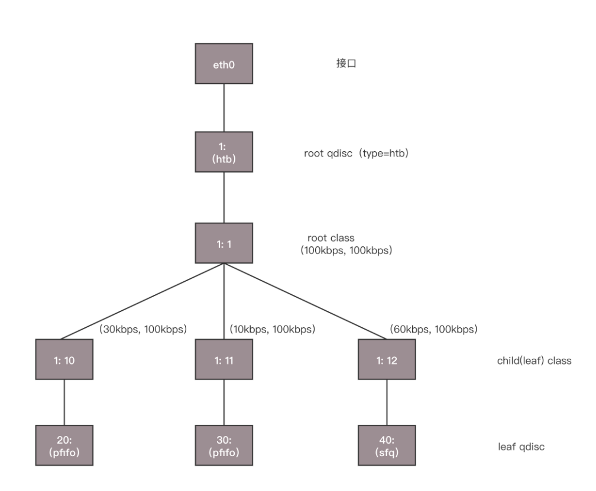
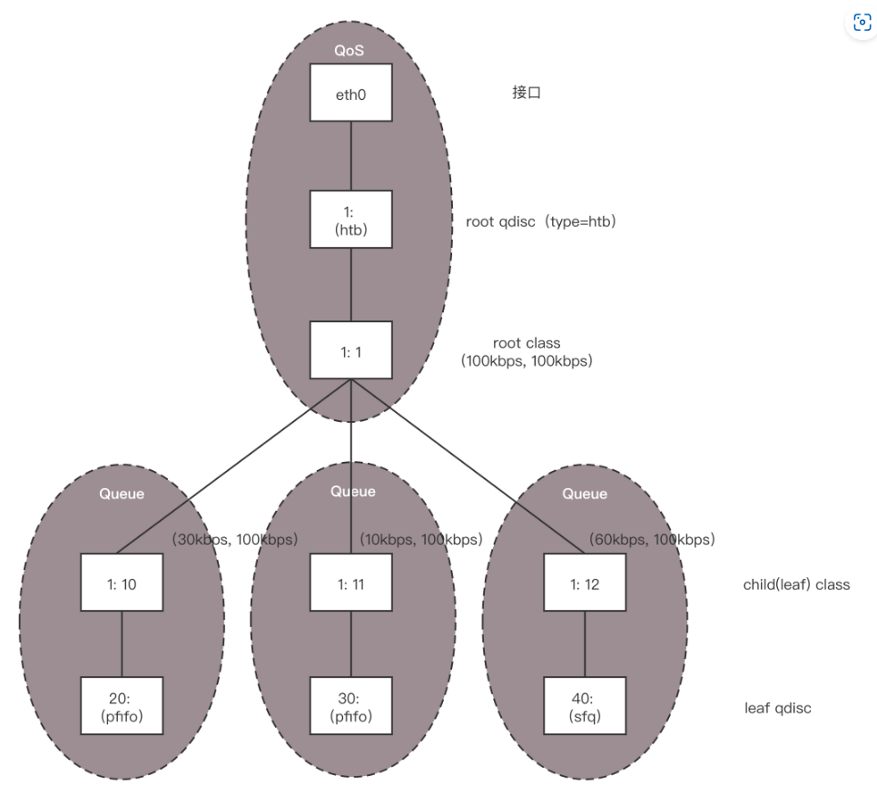

# 第27讲 云中的网络QoS：邻居疯狂下电影，我该怎么办？

## 一、 云中网络流量控制的痛点与解法

### 为什么需要流量控制 (QoS)？

云计算平台就像一栋大型合租公寓，所有虚拟机都在共享物理网卡的带宽：

1. **资源抢占（木桶效应）**：如果某个租户不自觉，在虚拟机里疯狂运行下载任务（或遭遇了 DDoS 攻击），会瞬间把物理网卡的公共带宽占满，导致其他正常租户连网页都打不开。
2. **保障服务质量**：云平台作为“房东”，必须要有公平的机制，确保每个租户都能获得与其购买规格相匹配的网络带宽，绝不能“你用我也用，谁猛谁好用”。

**解法：QoS（服务质量控制）**

在网络中，流量控制分为出、入两个方向：

- **出方向 (Egress)**：流量从本机发出，我们可以很好地将它们排队，把多余的包缓存起来，控制成我们想要的速率发出去，这叫 **Shaping（流量整形）**。
- **入方向 (Ingress)**：别人发给你的包已经到达你的网卡了，你没法让它们在别人的机器上排队，因此无法整形。只能通过 **Policy（策略）** 将超出额度的包直接丢弃。
- **QoS (Quality of Service)**：服务质量。在网络中用来解决网络延迟和阻塞等问题的一种机制，通常表现为**限速、带宽保障和优先级分配**。
- **Shaping (流量整形)**：平滑网络流量，通过把多余的包放入队列缓冲并延时发送来实现限速。

---

## 二、 底层技术原理拆解：TC 与排队规则

在 Linux 底层，控制出方向流量的核心手段是**排队（Queuing）**。Linux 提供了 tc 命令来实现，主要分为以下两大类：

### 1. 无类别排队规则 (Classless Queuing)

这是一种相对简单的排队方式，不对网络包做极其详细的分类归属：

1. **pfifo_fast（优先先入先出）**：根据网络包内的 TOS (服务类型) 字段，将包分入 3 个优先级队列（Band 0、1、2）。必须等 Band 0 发完，才发 Band 1。
2. **随机公平队列 (SFQ)**：
    
    为不同的 TCP Session 计算 Hash 值，分发到众多小队列中。发包时，采用**轮询**策略从各个小队列依次取包发送。这样哪怕有人疯狂下载，也只会占满自己的 Hash 队列，保证了整体公平。
    
3. **令牌桶规则 (TBF)**：
    
    网络包 —> 进入队列缓冲 —> 获取固定速率生成的**令牌** —> 发送出网卡。
    
    *注意：桶是有容量限制的，防止网络空闲时积累大量令牌，突然来了大流量瞬间把所有令牌拿走，冲垮网络。*
    

### 2. 基于类别的队列规则 (Classful Queuing) 与 HTB

在复杂的云平台中，最常用的高级流控技术是 **HTB (分层令牌桶规则)**。它本质上是一棵树，专门用来管理多租户：

1. **根节点 (Root)**：规定了整张网卡的总体发送速率（比如最高 100kbps）。
2. **分支节点 (Class)**：为不同租户或应用划分子队列。每个分支有两个重要参数：
    - rate：日常保证速率（保底）。
    - ceil：最高极限速率（天花板）。
3. **借用机制（HTB 最大的亮点）**：同一个根底下的分支之间，可以**相互借用闲置流量**。如果分支 A 处于闲置，分支 B 的流量很大，B 可以突破自己的 rate，借用 A 的带宽（但最高不超过自己的 ceil），最大化利用整体物理带宽资源。
- **TC (Traffic Control)**：Linux 内核提供的流量控制命令行工具，用来配置和挂载各种队列规则。
- **HTB (Hierarchical Token Bucket)**：分层令牌桶，云平台中最常用的基于类别的流控规则，支持带宽的按比例分配与自动借用。

---

## 三、 在云网络中如何控制 QoS (结合 OpenvSwitch)

在云计算中，所有虚拟机的网卡都连在 OpenvSwitch (OVS) 虚拟交换机上。OVS 对上述 QoS 原理有着完美的支持：

1. **控制入方向 (Ingress)**：直接在虚拟机的 TAP 网卡端口上设置 ingress_policing_rate 和 burst 参数，超出限制的包立刻被 Policy 丢弃。
2. **控制出方向 (Egress shaping)**：
    - OVS 原生支持 linux-htb 类型的 QoS 规则。
    - 我们可以在 OVS 内部创建一棵 HTB 树，分配出多个不同 min-rate 和 max-rate（对应 rate 和 ceil）的 Queue（队列）。
    - **结合流表 (Flow Table)**：利用 OVS 强大的流表匹配能力，编写规则（例如：当包的源 IP 是租户 A 时），执行动作 actions=enqueue:端口号:队列号。
    - 这样就能精准地将不同虚拟机的发包流量，导入到 HTB 树的不同限速队列中。

**【流量分配推演（举例 3个租户配置的保证带宽比例为 3:1:6）】**：

- **满载情况**：三家同时疯狂发包 —> 总带宽严格按照 3:1:6 的比例公平划分。
- **闲置情况**：如果只有前两家全速发包，第三家（占6成）没发包 —> 闲置的 60% 带宽会自动被前两家借用，此时前两家按 3:1 瓜分全部带宽。既保证了各自业务底线，又不浪费整体资源。

---

## 四、 小结

本节课核心脉络梳理：

1. 云计算不仅需要网络连通，更需要用 **QoS (服务质量控制)** 来解决邻居争抢带宽的灾难。
2. 流量控制的核心突破口在**出方向 (Egress)**，依赖于排队缓冲机制（Shaping）。
3. 队列分为无类别（如 SFQ、TBF）和有类别两类。最适合云平台的是 **HTB 分层令牌桶**，它支持多租户比例分配带宽，且能够智能借用闲置流量。
4. **OpenvSwitch** 结合灵活的 **流表过滤 (Flow Table)**，将特定的网络包精准送入特定的 HTB 队列，实现了云网络自动化的流控体系。

---

## 五、 思考题深度解析

- **思考题 1：入口流量其实没有办法控制，出口流量是可以很好控制的，你能想出一个控制云中的虚拟机的入口流量的方式吗？**
    
    **【深度解析】**
    
    入口流量直接通过 Policy 丢弃太粗暴了，会导致上层的 TCP 协议不断触发超时重传，严重恶化网络体验。既然我们只能对“出方向（Egress）”做平滑排队，Linux 提供了一种巧妙的虚拟网络黑科技：**IFB (Intermediate Functional Block) 设备**。
    
    我们可以利用 tc filter 的重定向（Redirect）功能，把原本准备进入真实网卡的**入口流量 (Ingress)**，强制牵引到一块**虚拟网卡 IFB** 上。此时，这批流量对于 IFB 网卡来说，就变成了**发出 (Egress)** 的流量。这样，我们就能在这块 IFB 虚拟网卡上光明正大地挂载 HTB 排队规则，从而变相地对“入口流量”也实现了完美的平滑限速和整形。
    
- **思考题 2：安全性和流量控制大概解决了，但是不同用户在物理网络的隔离还是没有解决，你知道怎么解决吗？**
    
    **【深度解析】**
    
    这是整个专栏云网络篇的“终极悬念”。
    
    前面第 24-26 讲提到的 OVS、安全组和本节的 QoS，都只是在解决“权限”和“分配”的问题。而在最底层的物理隔离上，如果一直使用传统的 VLAN 技术，它的 ID（Tag）仅仅只有 12 个比特，最多只能划分 4096 个子网。
    
    在阿里云、AWS 这种拥有百万级租户的公有云里，4096 个 VLAN 根本不够塞牙缝的。解决大规模物理网络隔离的终极武器，是走向大二层网络——即**隧道技术和叠加网络（Overlay Network）**。这也就是我们下一讲即将掀开的大名鼎鼎的 **GRE** 与 **VXLAN** 技术。它们能把二层的以太网包封装在 UDP 里，突破物理机房的硬件限制，支持多达 1600 万个租户的彻底隔离。
