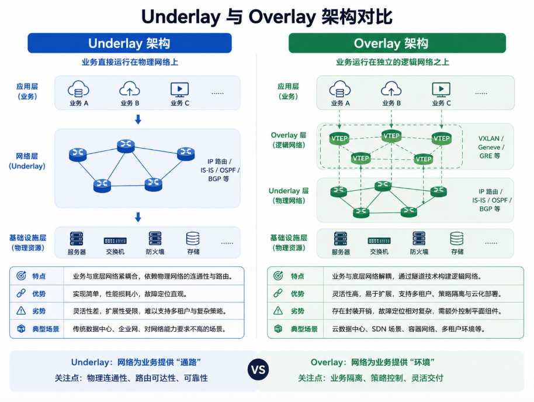
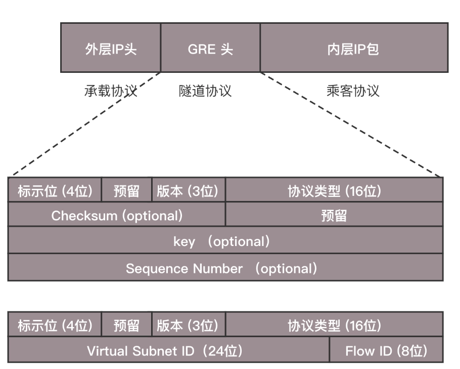
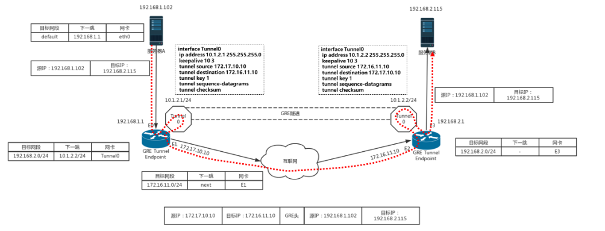
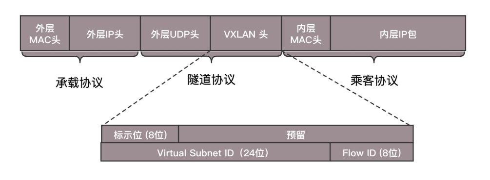
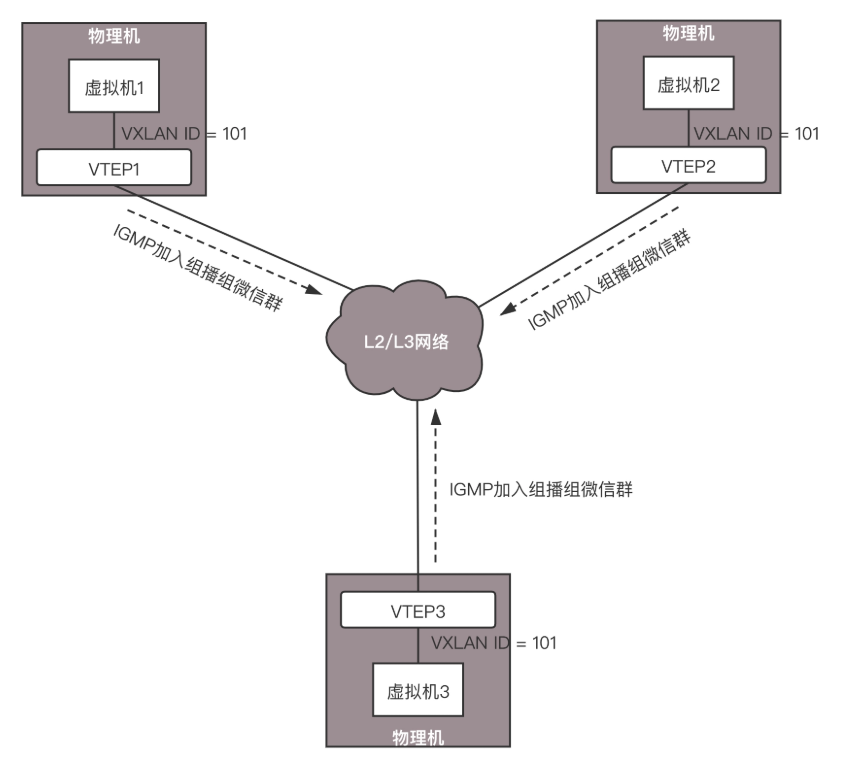
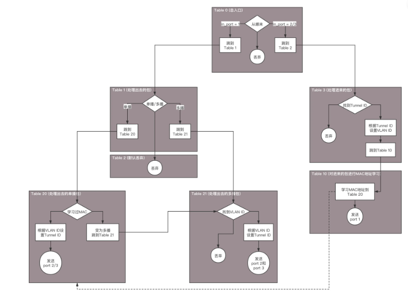

# 第28讲 云中网络的隔离GRE、VXLAN：虽然住一个小区，也要保护隐私

## 一、 为什么要网络隔离与 Overlay 网络

### 传统 VLAN 的天花板

在前面的课程中，云平台多租户网络隔离主要依赖 **VLAN** 技术。但在超大规模的云数据中心里，VLAN 暴露出了致命的缺陷：

1. **数量极其有限**：VLAN ID 在协议报文头中只有 12 个比特（bit），最大只能支持 **4096** 个网络。对于公有云动辄几十万甚至上百万的租户而言，这个数量微不足道。
2. **协议修改不可行**：如果要修改 VLAN 协议把 12 位改成 24 位，就需要全球千千万万已部署的硬件交换机和操作系统全部重构协议栈，这在工程上是一项不可能完成的任务。

**解法：隧道封装技术（Overlay 网络）**
既然不能直接修改底层物理协议，那就采用 **“套娃”** 的思路：在原始网络包外面再封装一层带有长网络 ID（如 24 位，支持 1600 万租户）的扩展包头，外层依然使用标准兼容的格式在物理网络中传输。

- **Underlay 网络**：底层的物理网络设备组成的、负责基础路由转发的真实物理网络（如交换机、路由器、物理网卡）。承载逻辑虚拟网络的底层物理网络基础设施，负责基础的 IP 路由和高速转发。
- **Overlay 网络**：在现有物理网络（Underlay）之上，利用隧道技术构建的逻辑虚拟网络，实现计算资源和物理网络的解耦。叠加在 Underlay 网络之上，用于虚拟机通信、多租户逻辑隔离的**虚拟化网络**。

---

## 二、 GRE (通用路由封装) 隧道技术

### 1. GRE 的封装包头格式

**GRE (Generic Routing Encapsulation)** 是一种 **IP-over-IP** 的三层隧道技术。它通过在原本的 IP 网络包外面套上一个 GRE 头和外层 IP 头来实现点对点传输。

- **标配前 32 位**：包含控制标识，用来判断后面有没有可选参数。
- **关键字段 Key (32位)**：存放用于区分不同用户的 **Tunnel ID**。32 位大小（即支持 42 亿个 ID）完全解决了 VLAN 4096 的上限限制。
- **NVGRE (网络虚拟化 GRE)**：一种专门用于网络虚拟化的变种格式，提供 24 位的 VSID（虚拟子网ID），同样能支持 1600 万个租户隔离。

### 2. GRE 隧道传输过程推演

假设主机 A (192.168.1.102) 想要通过 GRE 隧道访问跨网段的主机 B (192.168.2.115)。

**网络包封包与解包链路：**
主机 A 发送原始包（源：192.168.1.102，目：192.168.2.115） —> 默认网关（路由器1：192.168.1.1） —> 路由器匹配路由表，发现去 192.168.2.0/24 应该走 `Tunnel0` 接口 —> **在 Tunnel 端口进行封装** —> 在原始包头外套上 GRE 头，再套上外层 IP 头（外层源：172.17.10.10，外层目：172.16.11.10） —> 通过物理网卡发出 —> **在物理网络（Underlay）中普通路由转发** —> 到达对端路由器 2 的物理网卡 —> 送达路由器 2 的 `Tunnel0` 接口 —> **解封装（剥离外层 IP 头和 GRE 头）** —> 露出原始包 —> 路由器 2 匹配内网路由表 —> 最终送达主机 B。

### 3. GRE 的技术局限性

虽然解决了 VLAN ID 不够的问题，但 GRE 依然存在以下缺点：

1. **点对点点阵蔓延**：GRE 是一种点对点的隧道技术，如果要建立一个全互联网络，隧道数量会随着节点数量呈**指数性增长**  。$N \times (N-1)$  
2. **缺乏组播支持**：传统的 GRE 在虚拟化环境中实现多播/广播极其困难。
3. **硬件兼容性差**：目前许多防火墙和部分三层网络设备默认无法解析 GRE 报文。
- **GRE (Generic Routing Encapsulation)**：通用路由封装协议。一种将各种网络层协议的报文封装在 IP 报文中的三层隧道技术。

---

## 三、 VXLAN (虚拟可扩展局域网) 技术

### 1. VXLAN 的封装原理：二层套三层 (MAC-in-UDP)

VXLAN 是一种更加主流的大二层隧道技术。它突破了 GRE 在三层外套三层的局限，直接把**原始的二层 MAC 帧**封装进 **三层 UDP 包** 里。

- **VXLAN 头（8 字节）**：包含 24 位的 **VNI (VXLAN Network Identifier)**，支持 1600 万个隔离子网。
- **外层封装**：VXLAN 头外面套上 UDP 头（目的端口通常为 4789）、外层 IP 头、以及物理 Underlay 网络的 MAC 头。

### 2. VTEP 与 ARP 广播学习过程

VXLAN 解决多点互联和广播的关键在于 **VTEP（VXLAN 隧道端点）**。

**通信场景推演：**
同一租户（VNI = 101）下的虚拟机 1 想要通过 ARP 广播获取虚拟机 2 的 MAC 地址。

1. **ARP 请求发出**：虚拟机 1 发出 ARP 广播包。
2. **VTEP 封装与组播**：虚拟机 1 所在的物理机 VTEP 1 拦截该包。因为不知道虚拟机 2 的位置，VTEP 1 将 ARP 广播包封装进 VXLAN 头，并将外层 IP 设为该 VNI 提前绑定的**组播组 IP** 发出。
3. **多播分发**：Underlay 物理交换机通过组播路由，将该包复制并分发给所有加入该组播组的 VTEP（VTEP 2 和 VTEP 3）。
4. **解封装与单播回复**：VTEP 2 和 3 收到后解封装，发现是 ARP 广播，于是剥离外层，将原始 ARP 发给本地虚拟机。
5. **反向学习**：VTEP 2 在解包时，顺便在本地维护一张映射表：记录“虚拟机 1 的 MAC 对应 物理机 VTEP 1 的 IP”。
6. **单播响应**：虚拟机 2 收到 ARP 并单播回复。VTEP 2 拦截回复包，由于已经通过反向学习知道了虚拟机 1 的物理位置（VTEP 1），此时它不再组播，而是**直接用单播**将包发送给 VTEP 1。
7. **单播学习**：VTEP 1 收到单播回复，解包发给虚拟机 1，同时记录“虚拟机 2 的 MAC 对应 物理机 VTEP 2 的 IP”。此后，两台虚拟机之间的通信全部转为单播隧道流。
- **VTEP (VXLAN Tunnel Endpoint)**：VXLAN 隧道端点。负责 VXLAN 报文的封装与解封装，可以运行在物理交换机上，也可以运行在物理服务器的 OVS 内。
- **VNI (VXLAN Network Identifier)**：VXLAN 网络标识符。长度为 24 位，用于区分租户和逻辑网络。

### 3. OpenvSwitch (OVS) 多流表转发流水线

在实际的云平台（如 OpenStack）中，OVS 承担了 VTEP 的角色。由于网络逻辑极其复杂，OVS 摒弃了单表匹配，采用了 **多流表流水线 (Flow Table Pipeline)** 机制来处理隧道的封装和解封装：

1. **Table 0 (流量分类器)**：
    - 匹配规则 1：凡是从本地虚拟机网口（`in_port=1`）进来的包（准备发往外网），统一扔给 `Table 1` 流程处理。
    - 匹配规则 2：凡是从物理隧道网口（`in_port=2,3`）进来的包（外部流入），统一扔给 `Table 3` 流程处理。
2. **Table 1 (出站隧道封装)**：
    - 将本地的逻辑 VLAN ID 映射为 VXLAN/NVGRE 头部中的全局 Tunnel ID。
    - `dl_vlan=1 actions=strip_vlan,set_tunnel:0x1,output:2,output:3` (剥离局域网 VLAN 标签，打上 Tunnel ID 0x1，封装后从隧道口 2 和 3 发送出去)。
3. **Table 3 (入站解封装与 MAC 学习)**：
    - 将收到的 Tunnel ID 转换回本地 VLAN Tag。
    - 核心大招 `learn` 规则：在 Table 3 中，通过匹配到的包的源 MAC 和来源隧道，**动态往 Table 20（MAC学习表）中写入一条流表**。这条自动生成的流表会保存“目标 MAC 应该往哪个具体的端口发”。
4. **Table 20 (MAC 地址匹配与精准转发)**：
    - 检查该包的目的 MAC 地址是否在刚才 `learn` 自动生成的流表里。
    - 如果命中（有规则）：直接执行 `set_tunnel` / `output` 发送到对应的虚拟机网口。
    - 如果未命中（无规则，说明是首次通信的未知单播或广播包）：降级通过默认规则发送给 `Table 21` 处理。
5. **Table 21 (多播与洪泛处理)**：
    - 将数据包复制，往所有的隧道节点（port 2 和 port 3）进行组播/多播发送，以寻找目标 MAC 地址。
- **MAC地址自学习 (MAC Learning)**：交换机（包括虚拟交换机 OVS）通过监听数据包的源 MAC 地址和其输入端口，动态构建 MAC 地址表以决定后续网络包如何单播转发的技术。

---

## 四、 小结

本节课核心脉络梳理：

1. 传统的 VLAN 因为 **12 位 ID 限制 (4096个)** 无法满足云数据中心多租户的需求，必须通过 Overlay 隧道技术实现突破。
2. **GRE** 是一种点对点的 **IP-over-IP** 隧道技术。它采用 32 位的 Key 作为 Tunnel ID，解决了数量限制，但存在多点组网难、不支持组播的局限性。
3. **VXLAN** 采用 **MAC-in-UDP** 封装，利用 24 位的 VNI 支持 1600 万个隔离子网。它天生支持组播，并依赖 VTEP 在网络边缘进行封包和解包。
4. 在云网络的落地实现中，**OpenvSwitch** 依靠 **多流表转发流水线** (Table 0 -> 1 -> 3 -> 20 -> 21) 极其优雅、高弹性地完成了多租户 VLAN 到隧道 Tunnel ID 的转换、单播 MAC 学习和洪泛处理。

---

## 五、 思考题深度解析

- **思考题 1：虽然 VXLAN 可以支持组播，但是如果虚拟机数目比较多，在 Overlay 网络里面，广播风暴问题依然会很严重，你能想到什么办法解决这个问题吗？**
    
    **【深度解析】**
    是的，虚拟机一旦变多，ARP 广播包就会在物理 Underlay 网络中泛滥成灾。业界常用的优化手段主要有两种：
    
    1. **ARP 抑制 (ARP Suppression) / 提前代答**：
    由于云平台（如 OpenStack 或 Kubernetes 调度中心）在创建虚拟机时，就已经明确知道了每个虚拟机的 IP 和 MAC 地址的映射关系。当虚拟机 1 发起 ARP 请求时，本地物理机上的 OVS/VTEP 可以直接充当“内线”拦截该广播包，并用本地保存的映射表**直接代替虚拟机 2 回复 ARP 响应**。这样，原本需要组播全网的 ARP 广播包在本地物理机内部就被终结了，根本不会流向物理网络。
    2. **SDN 控制器统一下发 MAC 映射 (无组播模式)**：
    通过集中式的 SDN 控制器（例如 OpenDaylight、Ovn 等），将所有主机的 MAC 地址和其所在的 VTEP IP 地址的映射表，提前且实时地下发到每一台物理机的 OVS 流表（Table 20）中。这样，任何包在发出前都能通过流表实现 100% 的精准单播，物理网络中不再需要运行任何复杂的组播协议，彻底消灭广播风暴。
- **思考题 2：基于虚拟机的云比较复杂，而且虚拟机里面的网卡，到物理网络转换层次比较多，有一种比虚拟机更加轻量级的云的模式，你知道是什么吗？**
    
    **【深度解析】**
    这就是下一模块的绝对主角——**容器技术 (Container/Docker)**。
    虚拟机（VM）需要在物理机上虚拟出整套硬件，并在其内运行完整的 Guest OS，从虚拟网卡驱动到物理机 OVS 需要经历多次网络协议栈的反复拷贝和转换。
    而容器**不需要运行独立的操作系统**，它直接共享宿主机的操作系统内核，仅仅通过 Linux 的 **Namespace（命名空间）** 技术实现网络和进程的隔离，通过 **cgroups** 限制资源。
    由于没有虚拟化软件这一层的“高级骗术”，容器的网络数据包能够以接近物理机原生网卡的极高效率直接传输，更加轻量、灵巧，这也是微服务和云原生时代全面倒向容器网络（如 Flannel、Calico 等）的根本原因。
