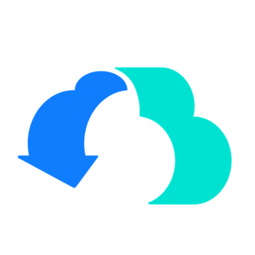

# 文章

用于技术文章、随笔、教程和复盘。

## 如何新增一篇文章（完整流程）

**只需要往 `content/posts/` 加文件，首页、写作列表、详情页都会自动出现**（构建期由 `app/lib/posts.ts` 扫描），不需要改任何代码。

### 1. 写正文：`content/posts/<slug>.md`

文件名即 slug，决定详情页地址：`/writing/<slug>`。frontmatter 字段：

```markdown
---
title: 文章标题
date: 2026-03-17
category: 学习笔记
tags:
  - Eino
  - AI
summary: 一两行的摘要，会显示在首页和写作列表。
---

正文从这里开始，支持标准 Markdown：
- 标题用 # / ## / ###
- 代码块用 ``` 围栏（可标注语言）
- 表格、引用、加粗、链接都支持
```

> `title`、`date` 必需，`category`、`tags`、`summary` 建议写全；缺 `summary` 首页摘要位置会空。

### 2. 放图片（两个用途）

| 用途 | 位置 | 说明 |
| --- | --- | --- |
| **封面**（首页卡片右侧缩略图） | `content/posts/<slug>/cover.png` | 可选。没有就显示色块占位。建议方形图（如 512×512） |
| **正文配图** | `content/posts/<slug>/任意名字.png` | 可选 |

图片支持 PNG、JPG/JPEG、WebP、GIF 和 AVIF；封面不支持 GIF。提交时 CI 会自动检查 frontmatter 和所有本地图片引用，路径写错会直接提示。

### 3. 在正文里引用图片

用**相对路径**引用，`./<slug>/图片名.png`：

```markdown

```

- 文件名带空格、中文都没问题（构建时自动处理）
- 图片与 md 文件放在同一个 `<slug>` 目录下即可
- 注意：`cover.png` 同时是封面，正文里引用它也没问题

### 4. 提交与上线

```bash
git add content/posts/<slug>.md content/posts/<slug>/
git commit -m "docs: 新增文章 <标题>"
git push origin main
```

- GitHub CI 自动 lint + 构建 + 渲染测试
- VPS 定时任务约 3 分钟内自动部署上线（无需手动操作）

---

## 现有内容

### 合集一：《趣谈网络协议》学习笔记

来自 Notion 数据库「刘超《趣谈网络协议》学习笔记」，共 5 篇（第 24–28 讲，云网络篇）：

| 文件 | 标题 |
| --- | --- |
| `24-cloud-vm-network.md` | 第24讲 云中网络：自己拿地成本高，购买公寓更灵活 |
| `25-software-defined-network.md` | 第25讲 软件定义网络：共享基础设施的小区物业管理办法 |
| `26-cloud-network-security.md` | 第26讲 云中的网络安全：虽然不是土豪，也需要基本安全和保障 |
| `27-cloud-network-qos.md` | 第27讲 云中的网络QoS：邻居疯狂下电影，我该怎么办？ |
| `28-gre-vxlan.md` | 第28讲 云中网络的隔离GRE、VXLAN：虽然住一个小区，也要保护隐私 |

### 合集二：Agent 学习笔记

| 文件 | 标题 | 说明 |
| --- | --- | --- |
| `from-toolcall-to-claw.md` | 从ToolCall开始组装自己的Claw | 已导入（从 Notion 本地缓存重建） |

### 合集三：Eino 入门（部分）

从 Notion 数据库「Eino入门」重建。**注意：本地缓存只有 2 篇有正文**，其余 15 篇（ChatTemplate、RAG概念、Embedding组件、ChatModel组件、编排概念、Indexer、Retriever、Transformer、Tool、编排、Graph高级特性、Eino Dev编排、CozeLoop、综合项目、ReAct Agent）正文未同步，需先在 Notion 桌面版打开这些页面让其同步到本地缓存，或导出 Markdown 后再导入：

| 文件 | 标题 |
| --- | --- |
| `eino-preface.md` | 食用前须知（合集前言） |
| `eino-multiagent.md` | 加餐：MultiAgent（MoE 编排） |

封面统一使用 CloudWeGo 品牌图标（Eino 所属开源家族），如需更换直接覆盖 `content/posts/eino-*/cover.png`。

## 从 Notion 导入的辅助脚本

- `scripts/notion-export.py`：从 Notion 桌面版本地缓存（`~/Library/Application Support/Notion/notion.db`）把页面重建为 Markdown
- `scripts/export_eino.py`：同上，针对 Eino 合集
- 注意：本地缓存只包含**最近打开过**的页面，未打开过的页面需要先在 Notion 里点开一次触发同步
